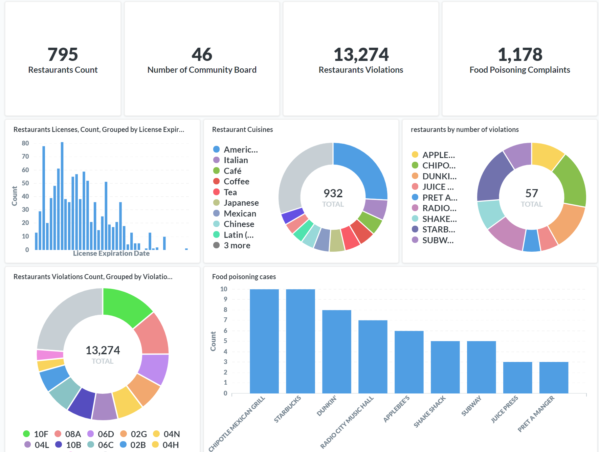

# Restaurant Inspection in New York City in light of the COVID-19

**A quick view of dashboard**

Considering the recovering state of New York City in light of the COVID-19 health crisis, NYC residents are now, more than ever, concerned with their personal health and safety. This is especially true regarding the cleanliness of all public spaces, and with health and safety standards of dining areas. With this said, we are crafting a database that makes DOHMH New York City Restaurant Inspection Results data easy to form queries and draw insights. The dataset we will use contains restaurant inspection data of active restaurants in the city who have been expected and, in some cases, have only applied for a permit but have not yet been inspected. The dataset is updated daily and contains information from every inspection conducted up to three years prior. Our plan of action will involve structuring the data and developing a relational schema to make sure it is normalized and ready for querying. While the goal of our efforts is to create a database that is understandable, organized, and easy to use, the analysts at the DOHMH offices can use queries that are informative for the public, providing easily accessible information for each restaurants inspection history, cleanest restaurants and more. The database our team designs can be used to improve the following scenarios:

1. Assist the DOHMH with inspection regimen planning, as it will help determine which restaurants will need further inspections

2. Benefit the restaurants. For instance, we can find the most common violations and violation trends. This information can inform restaurant owners of the common lapses which will be useful for the health & safety reviews that they may conduct.

3. Analyzing the distribution of restaurants by cuisine in each zip code region.

4. Ranking restaurants by the number of violations for public awareness

5. Group restaurants with similar degree of violations together, for ease of checking and managing

6. Provide recommendations for consumers who looking for safe and clean restaurants for different cuisine.

OKR
1. Design a 3NF database, populate the data in SQL
2. Submit a plan for how the customers will interact with the database system. What to implement for analysts (direct querying) and for "C" level officers (reports)? Plans for redundancy and performance?

**for analysts**
1. Identify restaurants by the number of violations 
2. Identify if there are more violations in weekdays or weekends
3. Identify cuisines that tend to have more violations
4. Group restaurants with same degree of number of violations together
5. Create plots and charts from the SQL query outputs using Seaborne/Matlab Plot in Python
6. Identify the most common liquor license types in each borough
7. Ranking restaurant cuisines by the number of food poison incidents
8. Identify the number of restaurant location types in each borough
9. Identify zip codes with most violations

  
**for "C" level officers (reports)**
1. Identify which restaurants will need further inspections
2. Summarize information such as the top 10 worst restaurants by violation rate

**This dashboard contains the following information:**

The number of restaurants, community board, restaurants violations, food poisoning complaints
Restaurants whose licenses will expire over time 
The distribution of restaurants’ cuisines in NYC
Restaurants with the most number of inspection violations, as shown in the pie chart, AppleBee has the most violations. 
The most frequent restaurants violations, as shown in the pie chart, they are 10F, 08A, 06D, referring to the referenced table, these violations are: 
- Non food contact surface improperly constructed
- Facility not vermin proof. Conditions to attract vermin and allow them to exist.
- Food contact surface not properly washed 
Restaurants with the most number of reported food poisoning cases, as shown in the bar chart, Chipotle and Starbucks have the most cases 

